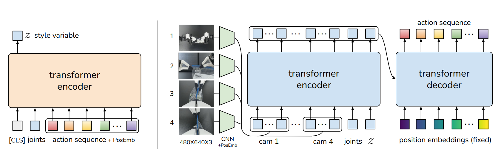
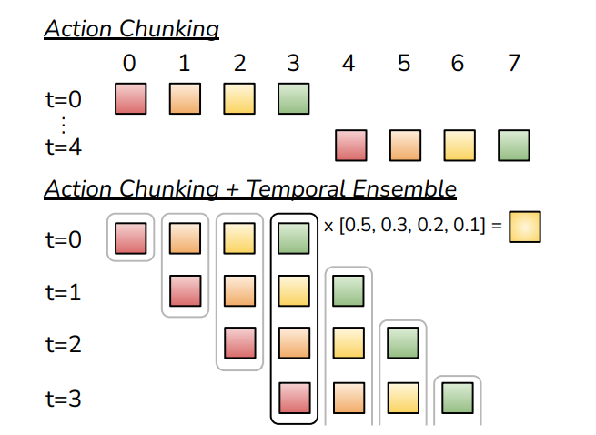
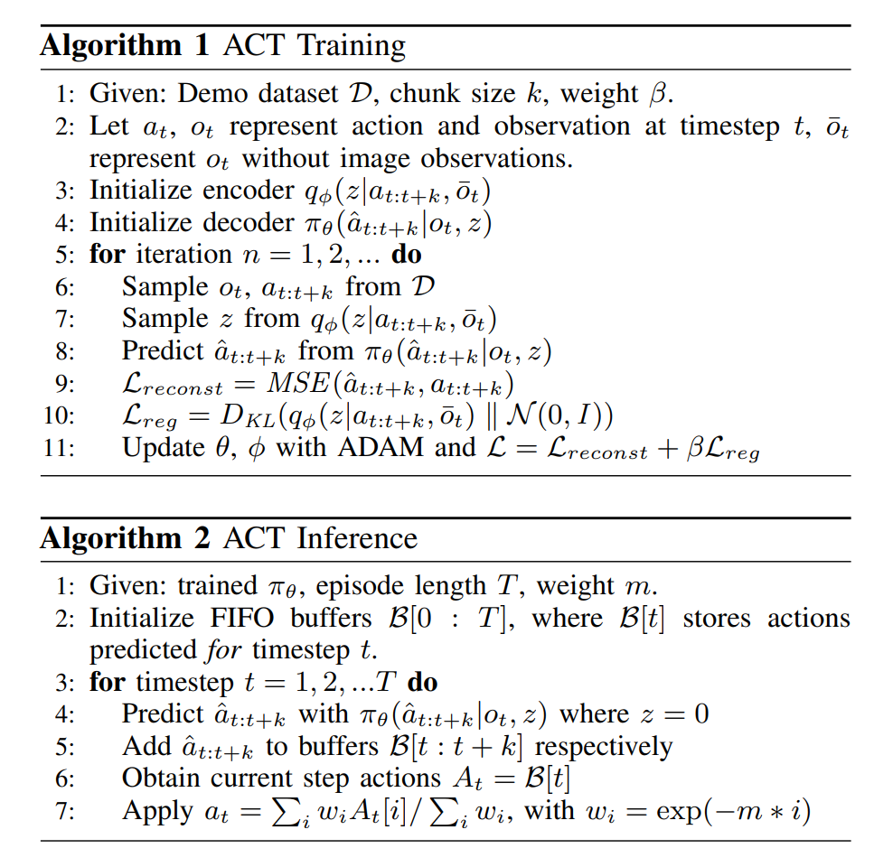

Action Chunking Transformer

整体架构：CVAE Encoder - CVAE Decoder
其中，CVAE 的 Condition 使用 Transformer 来获得。

CVAE Encoder 通过输入 [CLS, joints, action seq] 通过一个 Transformer encoder，在 [CLS] 的位置获得隐藏变量 $z$

接着，在 CVAE Decoder 部分，首先通过一个 Transformer Encoder 获得 Condition。Encoder 内容为 image, qpos, $z$。输出的 Condition 作为 Transformer Decoder 的 Condition。最后 Decoder 输出 action seq。

获取到当前时刻的 action seq 之后，需要经过一个时序累加的过程。通过对同一时刻但是由不同时刻预测的 action 进行带权累加，得到最终该时刻的 action。

代码中，ACT Training 部分的 loss 就是经典 VAE 训练的两部分 loss（采样的 MSE loss 和 KL 散度），Inference 部分就是预测和时序累加。

