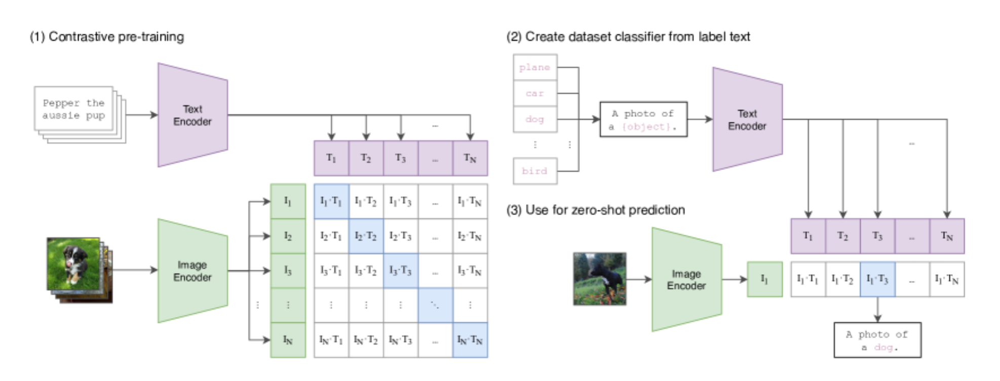
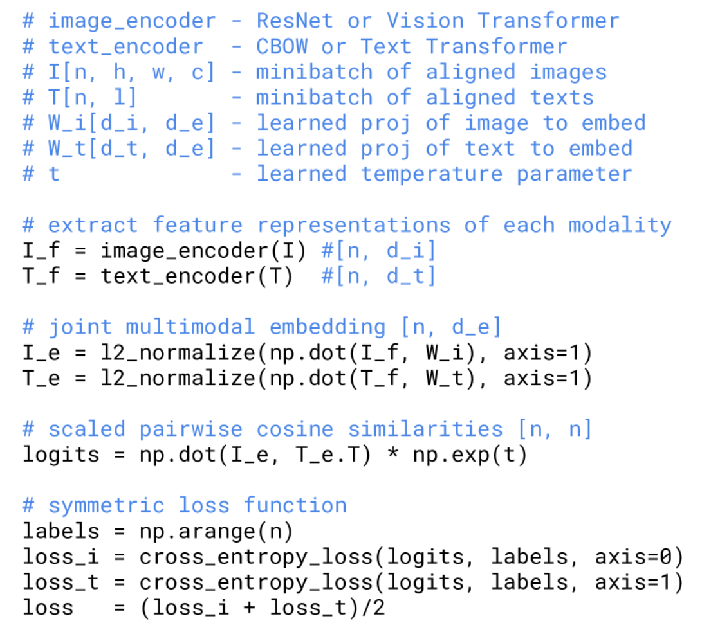

OpenAI 搞出来的 CLIP，用于视觉、文字融合，可以对某张图片进行内容文字预测。

CLIP 采用 contrastive 进行预训练。具体来说，将图片和对应的文字描述分别通过两个 encoder，得到两种模态的 embedding，接着，根据匹配关系来划分正样本。$T_i$ 和 $I_i$ 匹配，那么这两个就是正样本否则就是负样本计算 loss，这个 loss 和 moco 有点像但也有不同（moco 中采用 instance discrimination 来得到正样本，代码中就是对同一图片的两个 augment 互为正样本，和其他的互为负样本，而 CLIP 中正样本实际上已经确定了，就是图片和对应的文本，某种意义上有种有监督学习的感觉），其实 ViTaS 中使用的就是 CLIP-style contrastive。

claim：之前的工作都是预测图片文本的 exact word，会很复杂，而生成式模型的计算量也会很大。对比学习避开了这个问题，同时，预测的文本是整个图片对应的整个文本，而不是一个单词一个单词的来。

如何提取特征？图像 encoder 两种 - Resnet & ViT

Resnet - Resnet50、Resnet100、50x4、50x16、50x64

ViT - ViT-B/32、B/16、L/14

文字 encoder - transformer