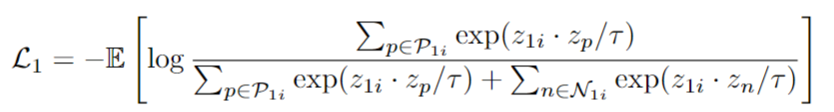

Neurips'20

zhihu 上的一篇介绍：[link](https://zhuanlan.zhihu.com/p/351443005)

InfoNCE 是通过 instance discrimination 来进行对比学习，即每个 instance 增强之后，与原来的 instance 互为正样本，与其它实例互为负样本，正样本要接近（pull），负样本要远离（repel），但是这未必完全充分的利用了数据。例如，同样是打球，RGB 模态可能因为背景不同而将两个打球的 video clip 认为是不同的负样本而推远，但是再另外的模态（如光流）中，可能二者是很接近的，理应拉近。可以得到，一个实例的正样本可能不止一个，而且可能是由不同模态决定的某两者是否互为正样本。

### 方法

以 RGB 和光流两个模态为例，对应了两个 encoder。首先，两个 encoder 分别进行 pre-train，也就是只单独对这个模态的信息进行对比学习，让 encoder 初步具有提取模态信息的能力。

然后，再将两个 encoder 联合训练（co-training）。具体来说，先将 encoder1 的参数 freeze，再利用 encoder1 对 RGB 模态下最接近的 top K 个样本取出来，这 K 个样本互为正样本，进行学习。contrastive loss 的形式几乎没变，只是将原来的 1 个正样本换成了多个：

利用这个 contrastive loss 对 encoder2 进行更新。接着重复操作，只是把 encoder 1 2 反过来（alternate）。

最后取的超参数 K=5，alternate 的粒度（或者就是切换的频率）取 100。事实上代码中似乎对 "切换" 的处理比较草率，就是先把 encoder1 freeze 了，再把 2 freeze 了，就结束了。

### 实验

用 linear probe 进行检验（将整个模型的参数冻住，下游套一个 MLP 层并执行下游任务）