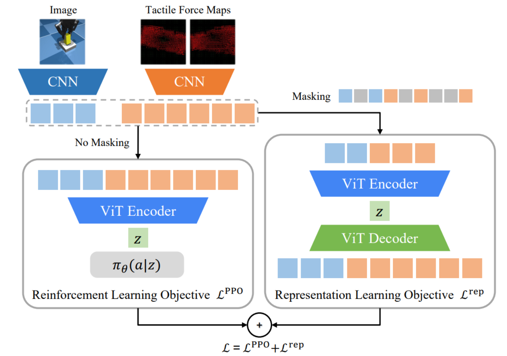

利用视觉和触觉同时提供的信息来指导 RL 的学习。
具体来说，学习目标由两部分组成：PPO 和 Representation。

PPO 就是将 image 和 tactile 通过 EarlyCNN，加上 positional embedding 等之后通过 MAE encoder，最后再通过 policy（PPO） 得到 PPO 的 loss。
而另一部分，Representation，通过实现了一个完整的 MAE 来训练 MAE encoder。注意 MAE encoder 是 policy 和 MAE 共享的，而 loss 更新时的梯度也会回传到 EarlyCNN 和 MAE encoder 中，两部分目标都能更新 encoder。这部分中，额外实现了一个 MAE decoder，用于 decode 得到的 embedding。这部分的 setting 和 MAE 原论文中一致。值得注意的是，encoder 是 visuotactile fusion 的，也就是说，是将视触觉融合之后通过 CNN，而不是分开训练 CNN。
训练目标就是 L_PPO 和 L_Rep 的加权和
实验方面，做的较为单薄，只有 insertion、door 和 cube，其中 cube 效果不符合 claim。而且实际上感觉提升并不大，拿个 vanilla CNN 也能做到接近的效果。