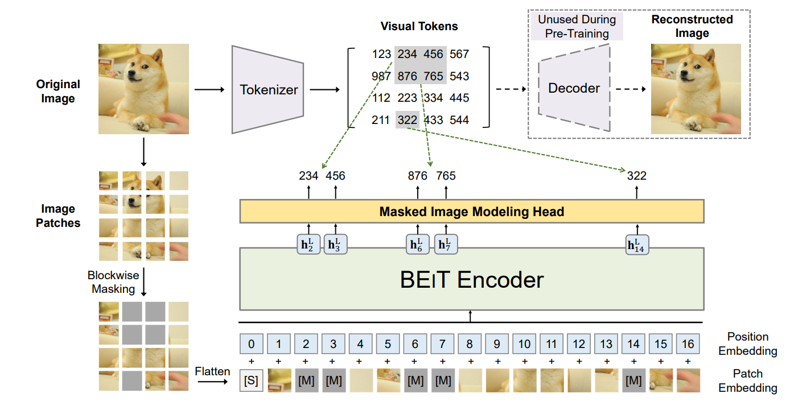

将一张图拆成若干个patch，mask掉一部分，通过 encoder，得到每个patch都对应着一个token（每个token是一个1~8192的整数）的distribution，将这个分布和gound truth做max likelihood，就得到loss。ground truth通过dall-e的预训练模型得到。

注意这里和MAE的重建patch的方法还不太一样，这个相当于还是个回归（dall-e vs. 自己预测的mask token），而MAE是自回归（自己和自己重建之后的做MSE）

每个patch得到token的过程使用dVAE，和VQ-VAE的区别是，dVAE没有codebook，是通过 Gumbel-Softmax 得到离散采样