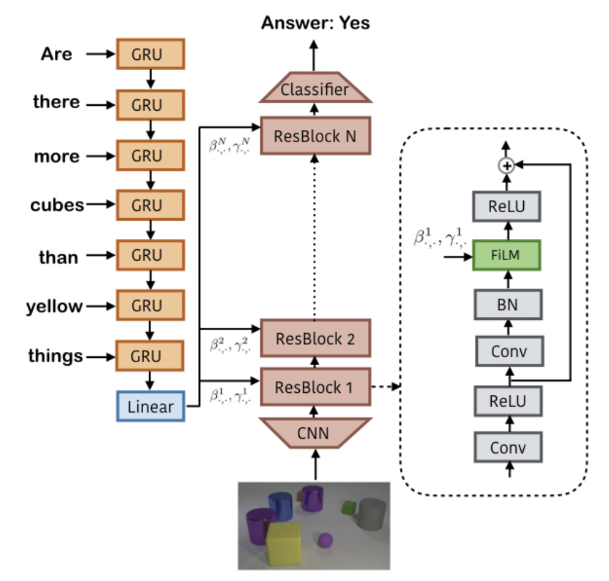

## BET
arxiv 2206.11251

motivation：过去的 sota 很难处理多模式多种行为的策略，容易弄混。

将 transformer 应用到生成 action 上。transformer 主要用于处理离散而非连续值，因此直接处理连续的 action 效果不好。将 action 利用 K-means cluster 到 $k$ 个离散的 bin 上，将一个 action 表示为 bin+连续的 offset，这样在使用 transformer 的时候，将先前若干个 observation 通过 encoder 之后再分别通过两个 projection head，就得到了 bin 和 offset 两个部分（其中 bin 为一个 distribution，而 offset 为一个 $|bin|\times |action|$ 的表格，当 sample 出一个 bin 之后，action 在对应的 bin 那一行上再 sample 一次就得到了对应的 action）。训练的时候也是容易的，将一个 action 拆成两部分之后训练对应的 projection head 即可。loss 的形式如下，只需要考虑在对应的 bin 中的 loss。

在 inference 的时候，我们就通过先前 $h$ 个 step 的 observation 输入到 transformer 后，分别通过两个头得到 bin 和 action，再通过 K-means decoder 就得到了最终的 action。

对 action 使用 encoder 还是挺巧妙的，通过划分出不同的 bin 来区分差距特别大的 action 也就是多行为的策略。但是和 fusion 可能关系并不大。pipeline：

## PRELUDE
arxiv 2209.09233

为了让 locomotion 表现的更好提出的。将机器狗的运动过程分为了两个部分进行训练。首先通过模仿学习让机器人学会 navigation，也就是找到一条路能够通行（称之为 high-level 的策略 $\pi_H$），接着使用强化学习让机器人学会 走 这个 low-level 动作 $\pi_L$。这样结合概率知识，我们需要学习的策略可以写成：$\pi(a_t|s_t)=\pi_L(a_t|u_t,s_t)\pi_H(u_t|s_t)$

第一个部分，high-level navigation，使用 BC 进行 IL，同时使用 RNN 来融合不同模态。这里使用的模态共有 3 种：RGB、Depth、Heading Direction（机器人运动的方向），其中前两个分别通过 encoder，三个模态通过 RNN 进行融合。此外，由于专家示范中可能存在噪声，使用 Guassian Mixture Model(GMM) 来减弱。

第二部分，low-level gait controller，使用 RL 来让真实环境中的运动过程稳定。RL backbone 采用 PPO，且让喂给 $\pi_L$ 的速度等信息随机化，来使得训练出的策略对真实环境具有鲁棒性。reward 使用三种：最小化动作和追踪指令（从 $\pi_H$ 得到的或者给定的）之间的差距以及最小化需要的能源，使得身体稳定、鼓励机器狗的脚能和地面有 concrete 的接触。有两种添加的部分：使用 domain randomization（对物理参数进行来避免处理环境中复杂的参数）、使用 buffer 来存近期的 robot states（注意不是直接存 raw obs）

## FiLM-layer
arxiv 1709.07871

一开始用于视觉推理（使用了视觉 & 语言两种模态的信息），在视觉推理中，需要处理两种模态的信息。首先，对于语言信息，一个问题通过若干个 GRU 模块处理每个单词，最后由一个 Linear 层求出 question embeddings，并给出每个 token 的 $\beta_i, \gamma_i$，其中 $\beta, \gamma$ 为仿射变换预测，并将每个嵌入给到 CV 部分处理。

CV 部分使用一个深层的网络结构。先通过一个 CNN，接着再串上若干个 res block。每个 res block 除了基础的 CNN 和 BN 之外，还有一层 FiLM，做了一个仿射变换。

$ FiLM(F_{i,c}|γ_{i,c}, β_{i,c}) = γ_{i,c}F_{i,c} + β_{i,c} $

$\beta, \gamma$ 本应由两个不同的网络产生，代表仿射变换（Feature-wise affine transformation）的 scaling 和 shifting，但是发现 share parameters 效果更好，就换成了一个网络产生两个值。

通常使用 FiLM 层在提取 feature 的基础上添加条件，即当 $x$ 为输入，$z$ 为条件时，有 $$FiLM(x)=\gamma(z) ⊙x+\beta(z)$$

## BAKU

使用了 RGB、text、proprio 的信息用于控制 agent 完成任务。如何利用不同模态的信息进行指导 action？首先，现将三种模态的信息分别通过 encoder，其中 text 通过一个 pre-trained text encoder，visual 通过 resnet-18，同时，加入 FiLM 层来增加 task-specific 信息。使用几个 MLP 层来提取 proprio 信息。

分别提取对应信息之后，在 obs trunk 中进行融合，obs trunk 最终选用的是一个 transformer decoder，其输入为上述 3 种信息作为 token 之外，还添加一个 learnable action token（向量），输出也有一个对应的 action feature。

最后，再将 action feature 给到 action head 提取出最终的 action。

由于本文比较新（2406），因此比较的 baseline 也可以研究一下，如 VQ-BET、diffusion policy。