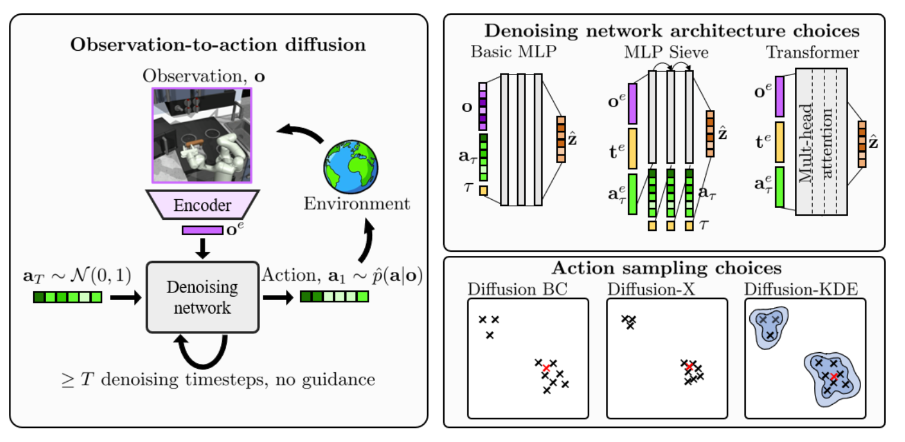

## Diffusion BC

和 dp 的想法类似。预测 noise 的 $\epsilon$ 实验了多种结构，如 MLP、MLP-Sieve（多层MLP，输入 $o_t, a_t, t$，每层 $a_t, t$ 由上层 MLP 的结果得到，$o_t$ 包含更多的步长的 obs）、Transformer，最后发现 Transformer 的结果更好。

发现无分类器指导（CFG）会削弱学习的效果。

其余的思想都和 dp 比较类似。实验上以仿真实验为主。