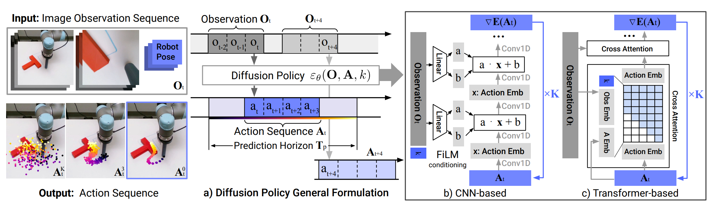
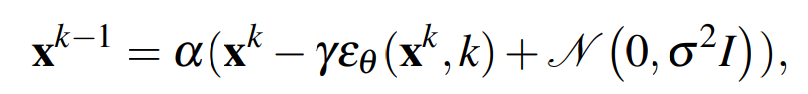
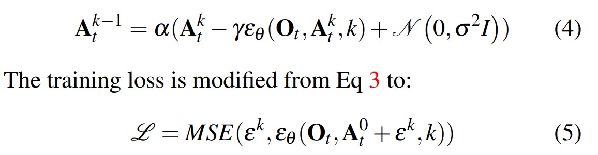

## diffusion policy
RSS'23

先前的模仿学习算法当遇到多峰的情况时，可能会导致只能学到单峰的行为（比如，在 push-T 任务中，可能存在不同方向推的行为，都能成功），本文通过将 diffusion 算法应用到 action space 进行操作，解决了这一问题。

本文主要贡献为：
1. 提出了闭环的动作序列。策略生成的是动作序列，能提升 temporal consistency 同时兼顾 long-horizon planning
2. 将视觉信息作为 action denoise 过程中的条件
3. 设计了一种 transformer-based diffusion network，能减小 CNN 的过度平滑效应

### visual condition

传统的 diffusion 训练过程如下：

其中，$\epsilon$ 表示 noise prediction，式子的含义即为每次迭代的时候减去一个预测出的 noise 值。$\epsilon$ 的训练就是通过加噪音实现的，最小化的目标就是让加的噪音和加上噪音之后的图通过 $\epsilon$ 产生的噪音的 MSE 尽可能小，即 $\mathcal{L}=MSE(\epsilon^k, \epsilon_{\theta}(x^0+\epsilon^k, k))$，根据 DDPM 原论文中的描述，这个优化目标就是优化降低数据分布和 DDPM 中样本的分布的 KL-divergence

本文中改进了 DDPM，将 visual observation 也作为 denoise 的 condition：

### Closed-loop action-sequence prediction

预测动作序列时，将先前 $T_o$ 个 step 的观测作为输入，输出预测一段 $T_p$ 个动作，执行 $T_a$ 个，这样的设计保证了 temporal consistency。

CNN-based model 使用的是 https://arxiv.org/pdf/2205.09991 这篇文章中提出的 conv1d，每轮再通过 obs 作为 film-layer 中的输入，每次 denoise 的时候通过一次 film-layer。优点是对超参数不太敏感，而且在大部分的任务上表现良好，缺点是对某些 action change 特别大的任务，会表现不好。

transformer-based model 也是本文提出的卖点之一，具体来说和 [BeT](./bet.md) 中的想法类似，都是拿一个 transformer decoder。不同点在于本文中，将当前 iterator k 和对应的有 noise 的 action 当作 input token 输入，然后将 transformer 输出当成是 'gradient' 并用于更新 $\epsilon$

### 特殊设计

使用的 visual encoder：resnet-18+两个 trick: 1. 不是使用的全局 pooling，而是 spatial pooling 用于保存空间的局部信息 2. 将 batchnorm 换成 groupnorm

DDPM 中的和 noise 有关的参数是 scheduler 的，最后选择了 Square Cosine Schedule。

### 读代码

以 ./diffusion_policy/policy/diffusion_unet_image_policy.py 为例，考察一下 CNN-based model 的运行过程。

`compute_loss`：求 trajectory 中通过一直加 noise 来更新噪音预测函数 $\epsilon^k$，具体来说 loss 就是加的噪音和 $\epsilon$ 预测出的噪音的 MSE。代码中 $\epsilon$ 就是 `self.model`。需要注意的一点是，`self.model` 除了喂 已经添加上噪音的 trajectory、当前的 timestep 之外，还添加了 global_cond，而这个是由当前 obs（即 image） 经过 obs_encoder 提取 feature 之后得到的，这里选用的 `self.model` 的结构是 ConditionalUnet1D，而在 ConditionalUnet1D 中，整体的结构和大小 和 U-net 类似，但是每一个块中，采用了 ConditionalResidualBlock1D，这里每个小 Block 中除了使用 Conv1d 来提取信息之外，还使用了 FiLM-layer，具体来说，输入 (x, cond)，那么输出的是 两层网络处理 x，且在中间加了个 FiLM-layer，以 cond 为输入，输出 scale & shift。

`predict_action`：输入 obs，输出 action。conditional_sample 输出的整个 metric，其中截断得到整个 action 的序列（长度=Ta，维度=Da）。

`conditional_sample`：这个就是 action denoise 的过程。由 self.model=$\epsilon$ 求出当前 noise_trajectory 和 timestep 对应的 noise，然后减掉这个噪声（通过 diffuser 中封装好的库 scheduler.step 来实现）。再次注意一下 self.model 就是 ConditionalUnet1D，结构同上面所说，可以发现这里就和 paper 中的 CNN-based 的方法大体吻合了（除了文章中并没有显式的体现这个 CNN 是 U-Net，embedding 大小是先减小后增大的）