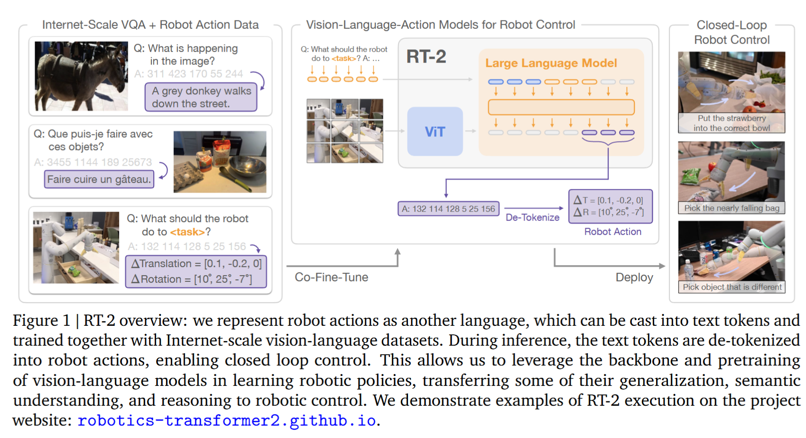

RT-2: Vision-Language-Action Models Transfer Web Knowledge to Robotic Control

VLA的工作，值得注意的一点是将 robot data 中的 action 表示为语言，方便和其他视觉-语言dataset（如问答集 VQA）一块训练

结构如图，没有什么特别值得注意的：

训练分为两个部分：使用视觉语言数据预训练；使用机器人动作微调

预训练：以图像为输入，输出用于表示自然语言的token，用于推断图像组成等功能，这部分实际上就是一个 VLM

动作微调：将输出动作离散化之后表示为几个token，具体来说就是action 的每一维都是一个256个token的bin，也就是将一个action变成了几维1~256的整数。然后将机器人的action数据也离散化成1~256，用于训练